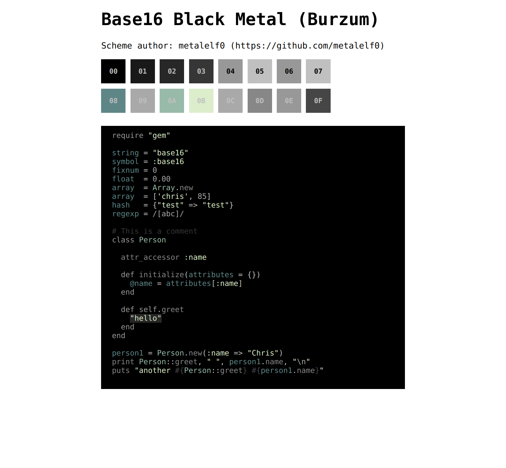
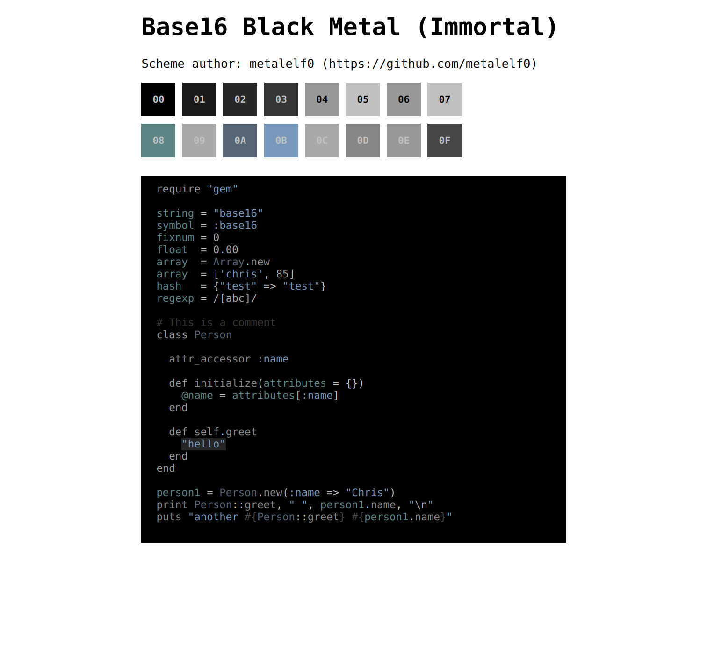
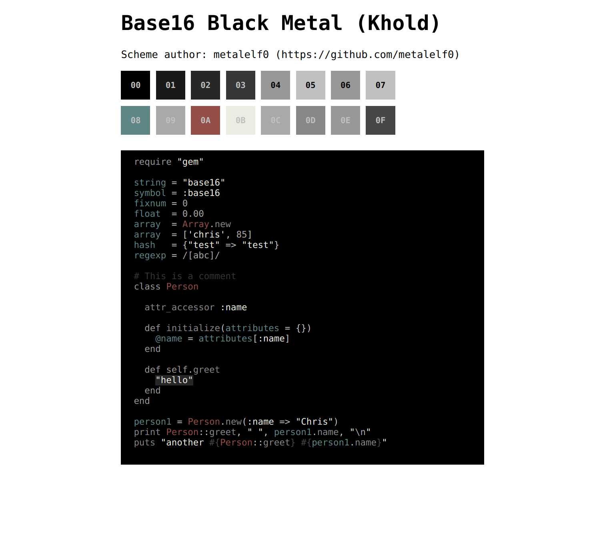
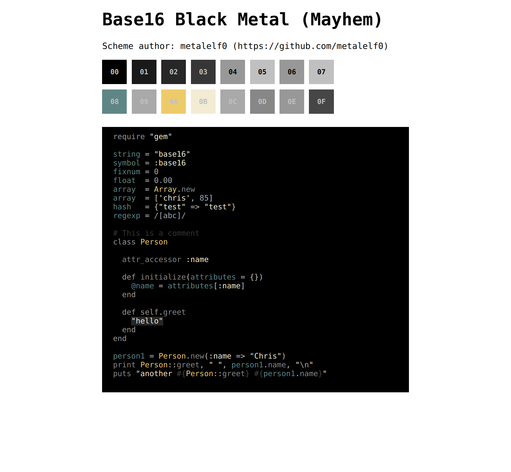
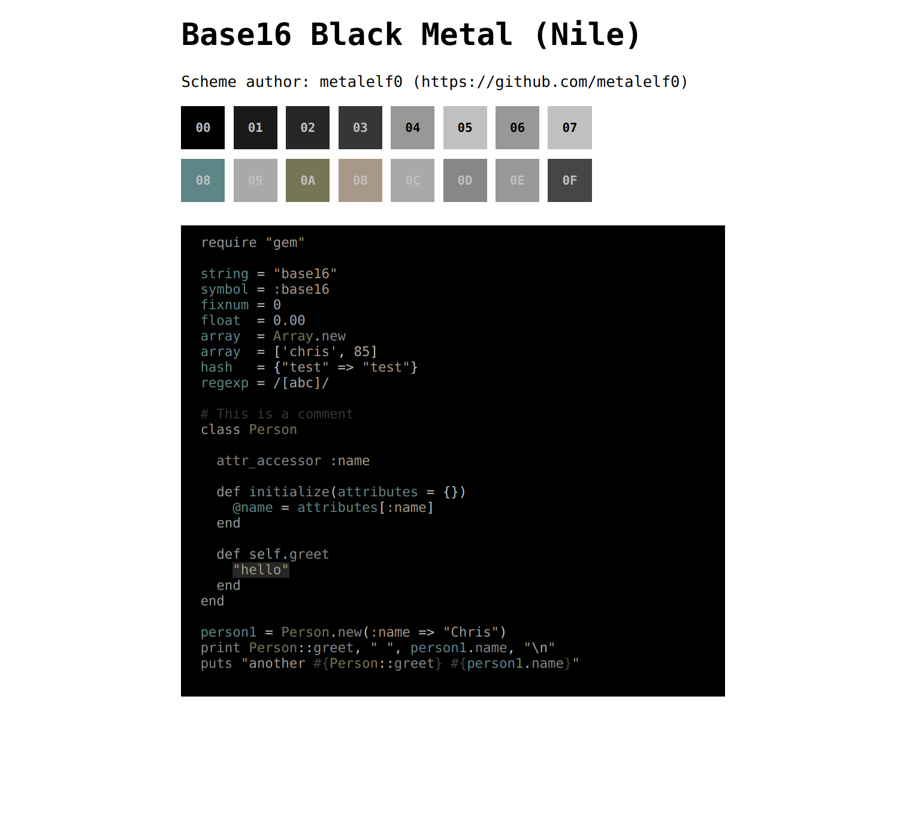

Base16 Black Metal
===

A collection of Black Metal inspired base16 schemes.

Previews
---












Howto
---

Vim colorschemes are included in this repo. Just add

```
Plug 'metalelf0/base16-black-metal-scheme'
```

to your `.vimrc` (or change it according to your plugin manager syntax).

If you want to build the full collection (terminal schemes, sublime, atom and so on) just use the yaml files with your favourite builder. I've built everything with [InspectorMustache/base16-builder-python](https://github.com/InspectorMustache/base16-builder-python).

Light variants
---

You're joking, aren't you?

Cover references
---

* Bathory: Hammerheart
* Burzum: Filosofem
* Dark Funeral: The secrets of the black arts
* Gorgoroth: Twilight of the idols
* Immortal: At the heart of winter
* Khold: Phantom
* Marduk: Panzer Division Marduk
* Mayhem: Dawn of the black hearts 
* Nile: Black seeds of vengeance
* Venom: Welcome to hell

Disclaimer
---

I know Nile don't play black metal, but I don't want to name the repo 'base16-black-and-technical-death-metal' `;)`.

License
---

This schemes are available as open source under the terms of the [MIT License](https://opensource.org/licenses/MIT).
